<div align="center">

  <!-- SaansCare Logo -->
  

  <br>

  <!-- Smart City Hackathon Badge -->
  <a href="https://youtu.be/z5LIsK0SFXU?si=NhtpJVr4jv0DgZLB" target="_blank">
    
  </a>

</div>
<div align="center">
  
<br> 

**An AI-powered air quality monitoring and public health dashboard for Lahore** 

</div>

---

## Table of Contents

- [About the Project](#-about-the-project)
- [Problem Statement](#-problem-statement)
- [Screenshots](#-screenshots)
- [Features](#-features)
- [Tech Stack](#-tech-stack)
- [Getting Started](#-getting-started)
- [Demo Accounts](#-demo-accounts)
- [Project Structure](#-project-structure)
- [Roadmap](#-roadmap)
- [Team](#-team)
- [License](#-license)

---

## About the Project

Lahore regularly ranks among the world's most polluted cities, especially during winter smog
season (November–February). Public AQI numbers exist, but a raw number doesn't tell a parent
whether it's safe for their child to play outside today, and it doesn't give a health department
a way to see *where* pollution-driven health burden is actually concentrated.

**SaansCare** closes that gap. It's not just an AQI viewer, it's a role-based platform that
turns two years of air-quality history into personalized health guidance for residents, city-wide
risk visibility for government officials, and full platform control for administrators, all
running against a real, live MySQL database.

## Problem Statement

Built for **Smart City Hackathon Lahore 2026** (organized by Code for Pakistan and Civic
Innovation Lab, in collaboration with Lahore Garrison University) under the **Clean City** theme:

> **"Linking Air Pollution to Public Health Outcomes"**
> Stakeholders: Punjab Environmental Protection Agency (EPA) & Primary and Secondary Healthcare Department

##  Screenshots

<!--
  Drop your screenshots into a /screenshots folder in the repo root, then swap the
  paths below. Suggested shots: Landing page, Resident dashboard, Gov dashboard,
  AI forecast card, Admin panel, and light-mode of any one of them.
-->

| Main Page | Features |
|---|---|
| 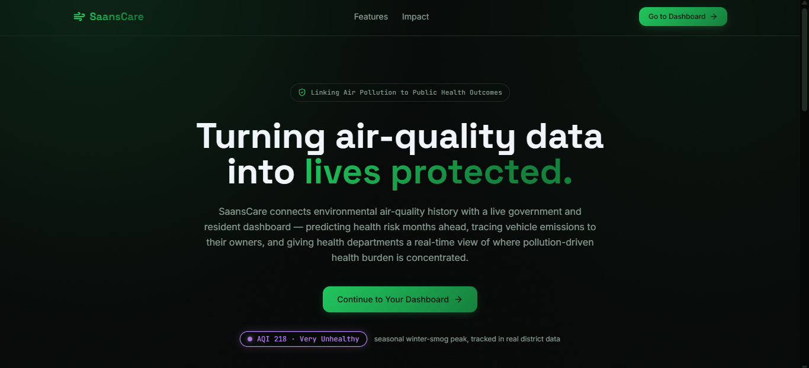 | 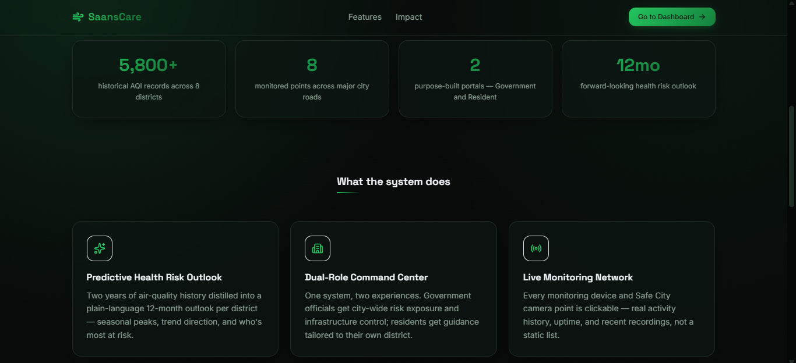 |

| Features | Explore |
|---|---|
| 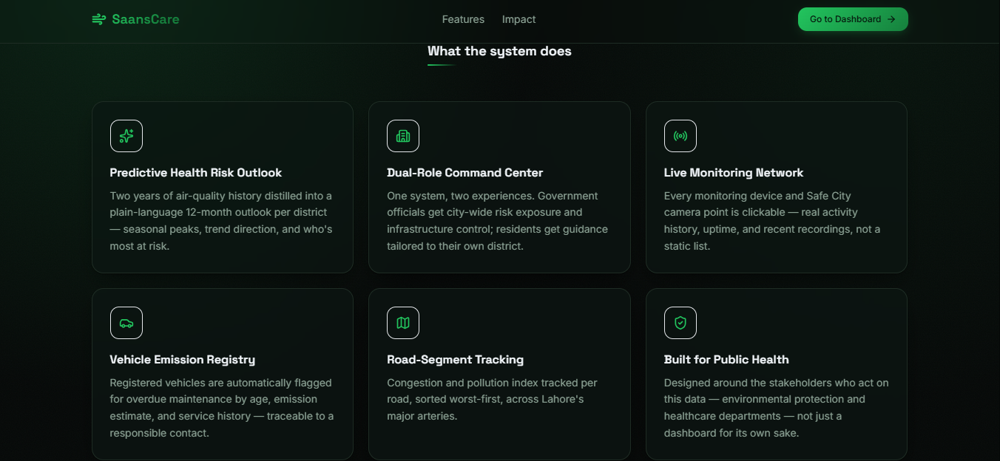 | 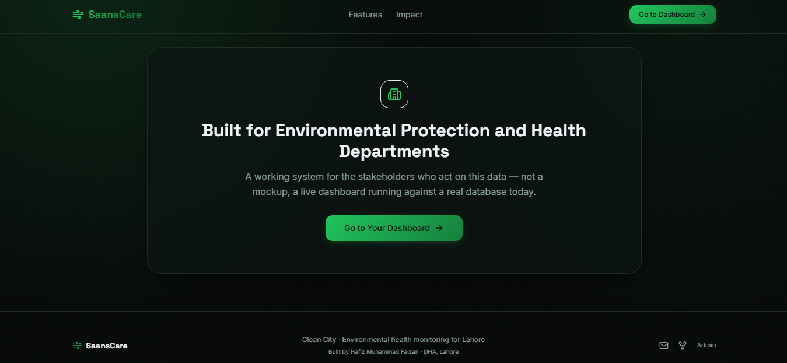 |

| Register / Login | GOV / EPA View |
|---|---|
| 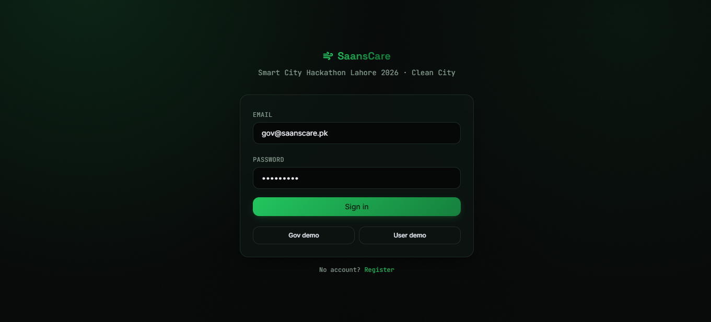 | 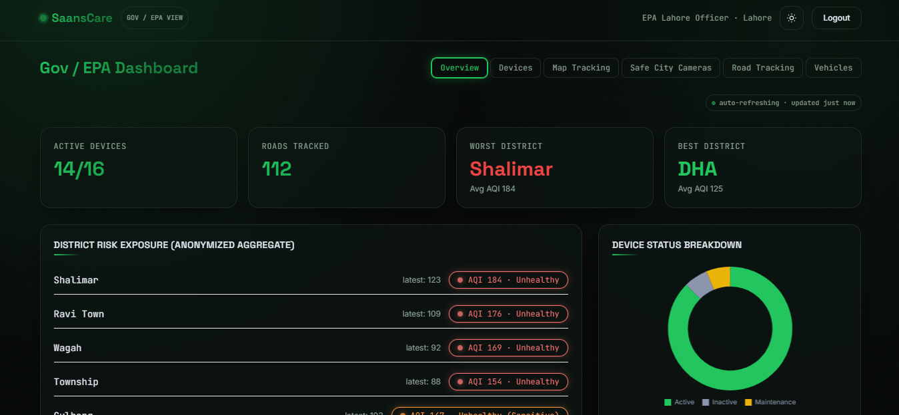 |

| AQI by District - Comparison | District Trend & AI Forecast |
|---|---|
| 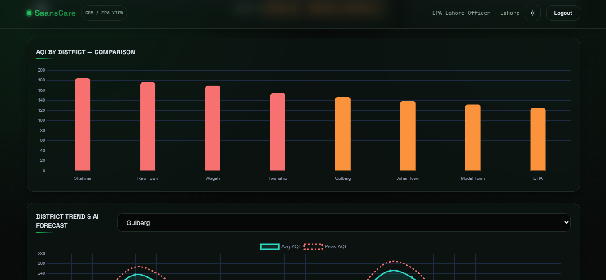 | 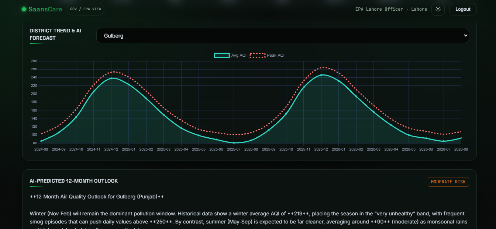 |

| Live Map - Devices & Safe City Cameras | Monitoring Devices |
|---|---|
| 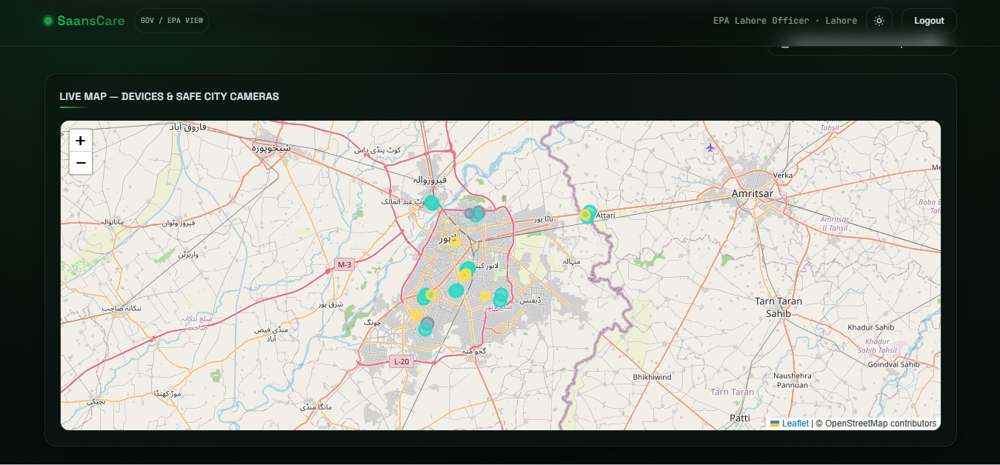 | 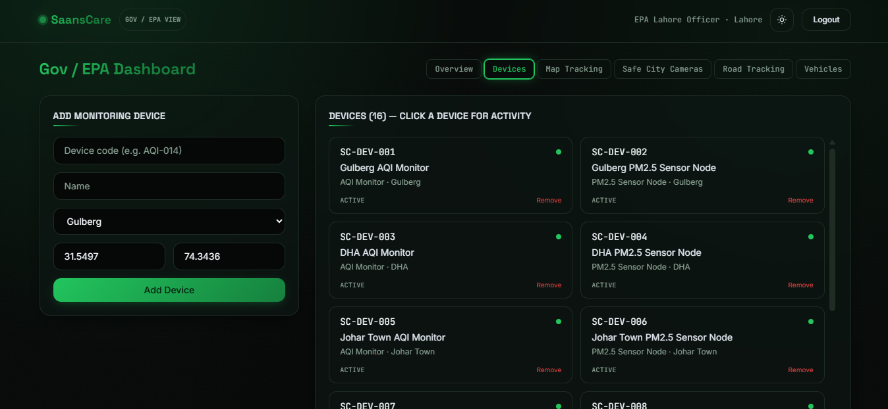 |

| City-wide Map Tracking | Camera Links - click to view feed |
|---|---|
| 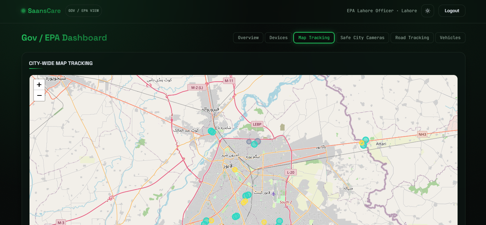 | 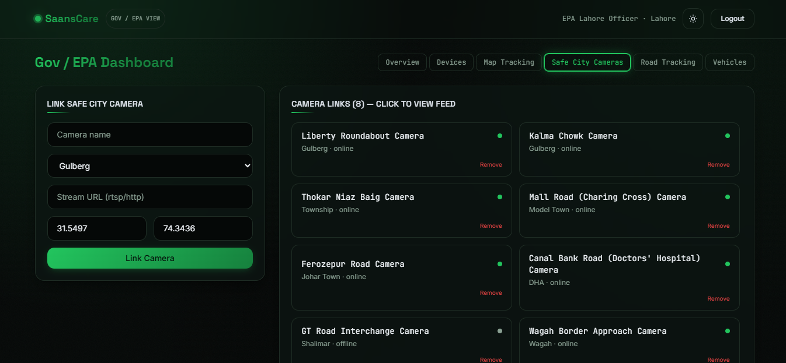 |

| Roads AQI Tracked | All Registered Vehicles - click for details & video |
|---|---|
| 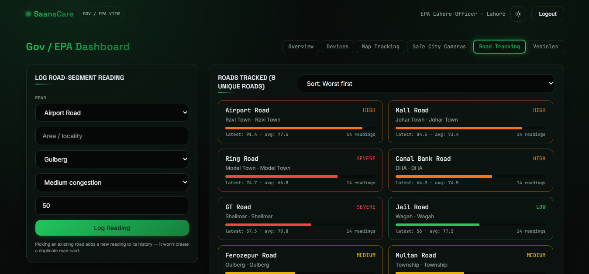 | 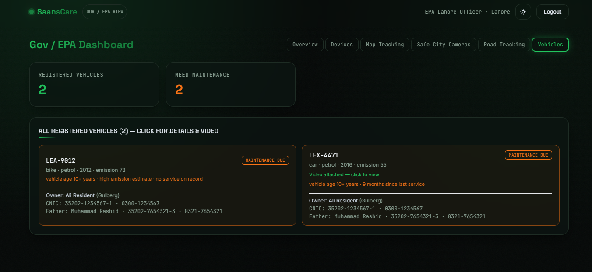 |

| Resident Dashboard | Light Mode |
|---|---|
| 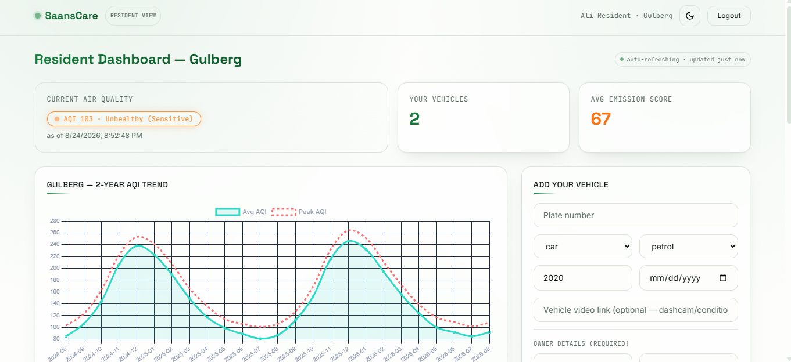 | 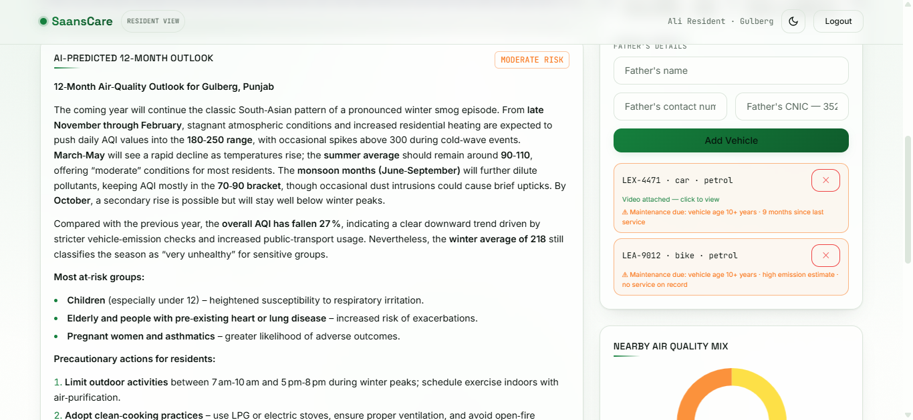 |

| Admin Panel | Light Mode |
|---|---|
| 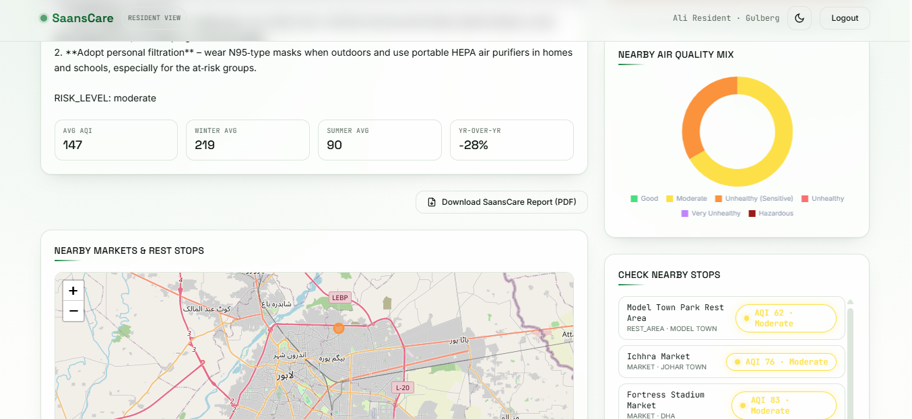 | 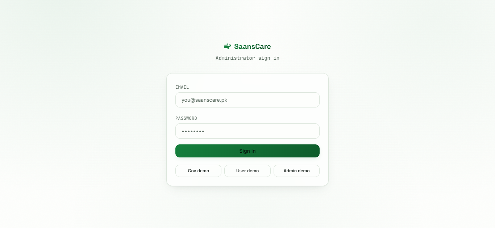 |

| Admin Panel | Light Mode |
|---|---|
| 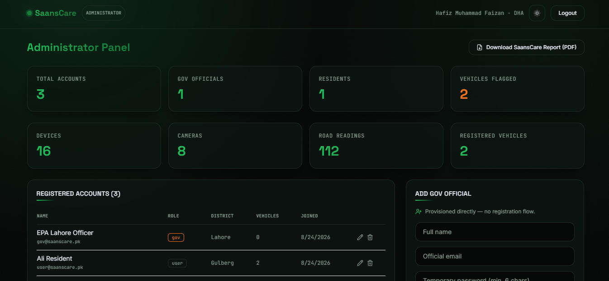 | 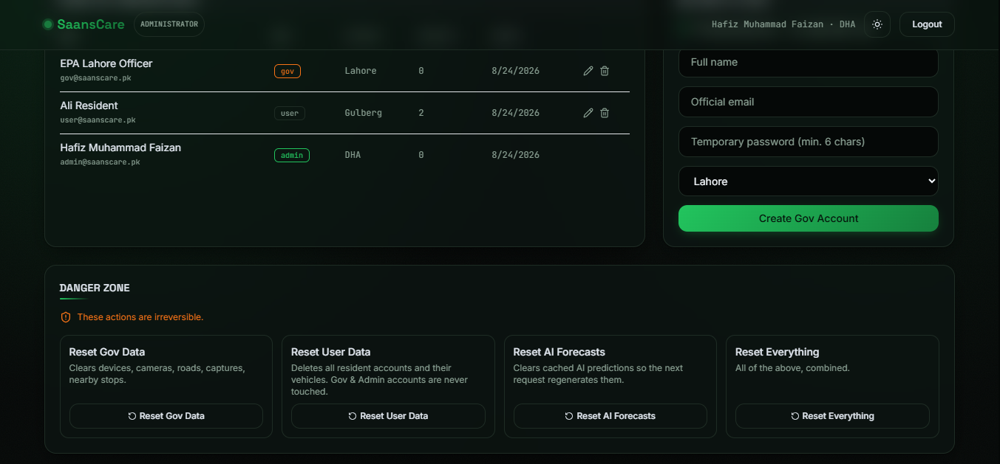 |

| Admin Panel | Light Mode |
|---|---|
| 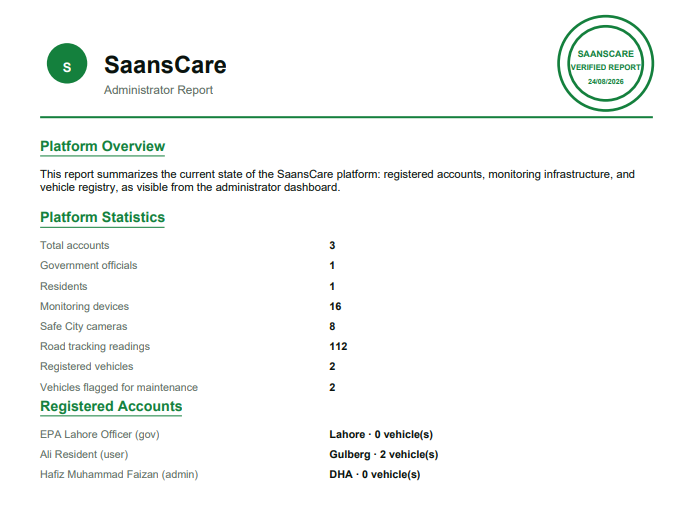 | 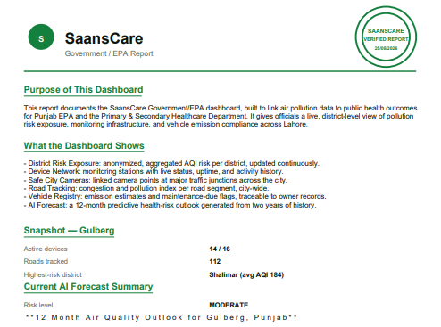 |

## Features

### Resident Portal
- Live AQI + 2-year historical trend for your district
- AI-generated 12-month health risk outlook (Groq LLM, with automatic rule-based fallback)
- Register your vehicle(s) with owner details for emission/maintenance tracking
- Nearby markets & rest stops ranked by live air quality

### Government / EPA Portal
- City-wide, anonymized district risk exposure — bar charts, trend comparisons
- Live monitoring device network — click any device for its activity history & uptime
- Safe City camera links at real Lahore landmarks, with reference footage
- Road-segment pollution & congestion tracking, aggregated per road
- Vehicle registry auto-flagged for overdue maintenance, traceable to the owner
- One-click PDF report generation with a SaansCare letterhead

### Administrator Panel
- Full account directory, every resident and official, structured and searchable
- Edit or remove accounts; provision new Gov officials directly (no open registration for that role)
- Scoped, confirm-gated data resets (Gov data / User data / AI forecasts / everything)
- Platform-wide statistics and its own PDF report

### Platform-wide
- Full light **and** dark themes, not an afterthought toggle
- Near-real-time polling with a visible "last updated" indicator
- Responsive, card-based UI throughout

## Tech Stack

**Frontend:** React 19 · Vite · Tailwind CSS · React Router · Chart.js · Leaflet · jsPDF · Lucide Icons
**Backend:** Node.js · Express · Sequelize ORM · MySQL · JWT Auth · bcrypt
**AI:** Groq LLM (`openai/gpt-oss-120b`) for narrative health-risk forecasts

## Getting Started

### Prerequisites
- Node.js 18+
- MySQL 8.0+

### 1. Clone the repo
```bash
git clone https://github.com/<your-username>/saanscare.git
cd saanscare
```

### 2. Set up the database
```bash
sudo mysql -u root -e "
CREATE DATABASE saanscare CHARACTER SET utf8mb4;
CREATE USER 'saanscare_app'@'localhost' IDENTIFIED WITH mysql_native_password BY 'YOUR_PASSWORD_HERE';
GRANT ALL PRIVILEGES ON saanscare.* TO 'saanscare_app'@'localhost';
FLUSH PRIVILEGES;
"
```

### 3. Backend
```bash
cd backend
npm install
cp .env.example .env    # fill in your DB credentials + (optional) Groq API key
npm run seed             # seeds ~5,800 historical AQI readings + demo accounts
npm run dev               # → http://localhost:5000
```

### 4. Frontend
```bash
cd frontend
npm install
npm run dev                # → http://localhost:5173
```

## Demo Accounts

| Role | Email | Password | How to reach it |
|---|---|---|---|
| Resident | `user@saanscare.pk` | `User@12345` | Login page, or register your own |
| Gov / EPA | `gov@saanscare.pk` | `Gov@12345` | Login page |
| Admin | `admin@saanscare.pk` | `Admin@12345` | Footer "Admin" link on the landing page |

> Gov and Admin accounts are never publicly registerable — provisioned via seeding or the Admin panel only.

## Project Structure

```
saanscare/
├── backend/
│   ├── src/
│   │   ├── config/       # DB connection (MySQL/SQLite)
│   │   ├── models/       # Sequelize models
│   │   ├── controllers/  # Route logic
│   │   ├── routes/       # Express routers
│   │   ├── services/     # Groq AI integration
│   │   └── seed/         # Historical data seeding
│   └── package.json
├── frontend/
│   ├── src/
│   │   ├── pages/        # Landing, Login, Register, 3 dashboards
│   │   ├── components/   # Reusable UI, charts, modals
│   │   ├── context/      # Auth + Theme providers
│   │   └── utils/        # PDF report generation
│   └── package.json
└── README.md
```

## Roadmap

- [ ] Live ingestion job against Punjab EPA's public AQI feed (currently seeded historical data)
- [ ] Official Safe City camera integration (currently reference footage, clearly labeled)
- [ ] Production deployment (Vercel + Render + hosted MySQL)
- [ ] SMS/push alerts for hazardous AQI thresholds

## Team

<div align="center">

**Team SaansCare**

| | |
|---|---|
| **Hafiz Muhammad Faizan** | Lahore Garrison University, Lahore, Pakistan |
| **Huma Aslam** | Lahore Garrison University, Lahore, Pakistan |

</div>

Built for **Smart City Hackathon Lahore 2026**, organized by Code for Pakistan and Civic
Innovation Lab, in collaboration with Lahore Garrison University.

## License

Distributed under the MIT License.

---

<div align="center">

**Cleaner Air Today, Healthier Tomorrow.**

</div>
